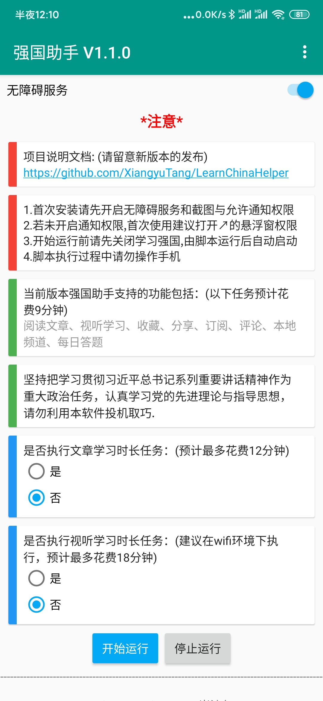

# 《强国助手》说明文档

点击下载当前最新版本：[V2.0.9](https://github.com/XiangyuTang/LearnChinaHelper/releases/download/V2.0.9/v2.0.9.apk)

## 免责声明

《强国助手》为本人Auto.js学习交流的开源非营利项目，仅作为程序员之间相互学习交流之用，使用需严格遵守开源许可协议。严禁用于商业用途，禁止使用《强国助手》进行任何盈利活动。对一切非法使用所产生的后果，本人概不负责。具体声明如下：

1.本项目供程序员日常学习交流使用，**不得用于其他任何商业用途**。

2.apk软件是本人利用Auto.js打包插件完成的，不包含病毒可放心安装使用。

3.本项目不提倡每天利用脚本软件来刷《学习强国》积分。

4.希望大家正视脚本内容本身，坚持把学习贯彻习近平总书记系列重要讲话精神作为重大政治任务，认真学习党的先进理论与指导思想，**请勿利用本软件投机取巧**。

5.经过n个账号的两天测试，暂未发现封号风险，理论上Auto.js模仿人的思路对控件进行模拟点击，如果每天一直使用，不保证不会封号。

6.经向专业律师咨询，**本声明有效，具有法律效力**。

## 一、文档介绍

本文档的目的是在经过《学习强国》安卓脚本的实战开发后，梳理个人在学习Auto.js过程中的知识点，并对每一个功能进行思路讲解和代码介绍，希望能通过本项目帮助学习Auto.js的人更进一步理解脚本开发步骤和原理。

如果对您有帮助，欢迎您star⭐一下小星星~

**仓库内容：**

Images文件夹——存放演示图片和视频

强国助手历史版本文件夹——仅作为备份用

强国助手 vX.X.X .apk —— 当前完善的最新版本，脚本打包后封装好的安卓软件应用安装包

学习强国.apk——学习强国v2.10.0版本（截至2020.3.21官方最新版）

Auto.js官方API文档——字面意思

autojs.apk——autojs手机开发IDE（版本：4.1.1 Alpha2）

AutoLearnChina.js —— 当前最新的核心脚本执行文件

Readme.md —— 《强国助手》说明文档

## 二、产品介绍

本项目是一款基于Auto.js工具开发的安卓脚本应用软件，依靠目前的脚本能够执行学习强国v2.10.0的**所有积分任务**，每日最多能够获得59积分（当日所能获得的所有分值）。

在当日未执行必做任务的情况下，脚本完成如下任务1-7预计共花费7分钟。

其中**必做（必启动）任务**包括：

1.阅读文章

2.视听学习

3.收藏

4.分享

5.订阅

6.评论

7.本地频道

用户**可选择执行**的任务包括：

8.每日答题（预计花费2分钟）

9.每周答题（预计花费2分钟）

10.专项答题（预计花费2分钟）

11.挑战答题（预计花费2分钟）

12.文章学习时长（预计花费12分钟）

13.视听学习时长（预计花费18分钟）

### 强国助手APP更新日志

- V2.0.9：将订阅任务变为可选任务(方便已经订阅完所有订阅号的用户)，更改界面UI布局，加入免责声明条款
- V2.0.8：增加向用户主动推送版本更新通知的功能
- V2.0.7：优化挑战答题中无法获取选项后的处理办法
- V2.0.6：优化每周答题和专项答题已经无题可答的边界情况
- V2.0.5：优化订阅任务中所有订阅号已经订阅完的边界情况
- V2.0.4：增加长时任务防止陷入死循环的检测机制，优化填空题答案为空时的解决方案
- V2.0.3：修改每日和每周答题模块的bug，优化多选题的正则匹配机制
- V2.0.2：优化多选题时间和选择机制，将答题模块调整至可选任务，对UI布局进行细微调整
- V2.0.1：优化答题模块的速度，修复每周答题和专项答题第一次没得满分后重做失败的bug
- V2.0.0：新增每周答题、专项答题、挑战答题任务功能，新增收藏和评论任务擦除痕迹功能
- V1.1.0：新增每日答题任务功能
- V1.0.5：新增悬浮窗日志显示功能，解决阅读时长任务的bug，新增选项菜单
- V1.0.4：解决手机主界面UI字符的屏幕适配问题，解决获取任务列表不稳定的问题
- V1.0.3：更新脚本应用的UI效果，增加用户手机息屏检测和屏幕激活，增加看视频时用户是否使用手机流量的检测机制，解决不能首次执行长时阅读任务的BUG
- V1.0.0：正式发布至GitHub平台

## 三、如何使用？

**版本要求：**

1.手机系统：仅支持安卓系统，安卓7.0以上。

2.手机型号：

目前经过测试能正常运行的：

红米K20 Pro（安卓10）、华为nova5pro（安卓10）、华为荣耀20（安卓10）、华为P20 Pro（安卓10）其他机型未知。

其中**解决华为手机不能显示脚本执行过程**的通知办法：进入手机管家-病毒查杀-风险管控中心-对强国助手解除管控-再打开设置-通知-允许强国助手发送通知

未通过测试的：

oppo A59s（安卓5.1）、红米 note4（安卓6）

3.应用版本：《学习强国》v2.10.0

目前以上版本以通过测试，其他版本机型未知。

**使用手册**：（建议在Wifi状态下执行脚本软件，因为会涉及到自动观看视频）

1.下载apk软件，安装；（有的小白可能只需要apk，可点击说明文档最上方的超链接直接下载，也可点击仓库最外层的强国助手vx.x.x.apk文件，也可进入本项目的release下载对应的最新版本，release中也有对应的js源代码）

2.关闭《学习强国》软件，打开《强国助手》软件，由强国助手自动启动学习强国；

3.需要打开《强国助手》的无障碍服务和截图功能，到时根据软件提示进行相应操作即可；

4.无需输入任何配置参数，选择是否执行可选任务后，一键运行。

5.在程序运行过程中将手机放到一旁即可，最好不要中途操纵手机，等待程序执行结束，即可查看获得积分或关闭《学习强国》。

**附：**

如果不小心中途操作手机跳出了学习强国页面，导致脚本执行失败，关闭学习强国软件，重启脚本软件再执行即可。

通常情况下**每5秒内会更新脚本执行消息并在屏幕下方显示通知信息（见软件效果静态展示）**，如果脚本在执行过程中未出现执行过程提示信息但仍在正常执行，请**确认手机设置中是否已打开允许强国助手通知**（如上华为手机开启通知的解决办法）；如果超过20秒学习强国页面未变化，则可能出现了异常，此时关闭学习强国，重启脚本软件再执行即可。

由于脚本并未做学习强国全版本测试，也没有钱做更多的机型适配测试，所以欢迎广大程序员来疯狂测试，程序也存在很多不足，欢迎大家批评指正！望共同进步！

**使用效果：**

1.软件主页（V1.1.0）：



2.使用过程静态展示：

<figure class="testphoto">
	<center>
	
	
	
    
	</center>
</figure>


3.使用过程动态展示：(以V1.0.0为例，可见Image文件夹中的视频文件)


## 四、如何进行迭代式增量开发？

参与贡献（内附提交方法）：https://github.com/Alivon/Panda-Learning/blob/master/CONTRIBUTING.md

### 1.了解什么是Auto.js

**Auto.js**是一个支持无障碍服务的Android平台上的JavaScript IDE，可以编写各种自动化脚本，它主要有以下优点：

1. 无需root：基于无障碍服务；
2. 基于控件：以坐标为基础的按键精灵、脚本精灵很容易出现分辨率问题，而以控件为基础的Auto.js则没有这个问题；
3. 上手简单：使用javascript编写，支持中文变量名；
4. 可打包 ：可以将JavaScript打包为apk文件，这一点可以简化用户操作，对上了年纪的用户很重要；

### 2.配置安装Auto.js和VScode、TotalControl等电脑调试及投屏软件

Auto.js下载与详细介绍：https://github.com/hyb1996/Auto.js/

项目开发的准备工作：https://www.bilibili.com/video/av93396608

Auto.js入门教程：https://space.bilibili.com/21486893

学完了以上3个链接，相信你一定对Auto.js开发有了比较全面基础的理解，在我看来，安卓脚本开发中最难的就是控件的寻找，如果找到了控件，接下来对控件的操作只要学会查API文档，就能应付开发中的大部分情况了。

### ３.打开本项目的AutoLearnChina.js 

目前本项目已经完成了所有的任务功能模块的开发。

### ４.从App应用的一个页面开始，新建文件对该页面上需要完成的功能进行开发。

复制空方法体到一个新文件，或是新建一个函数体，在该新文件中对该方法要完成的功能进行开发，开发完成后复制到原文件中即可。


## 五、已完成功能的代码思路介绍

**教程：**

JS入门：https://www.bilibili.com/video/av35958121

控件寻找：https://www.bilibili.com/video/av36724143

控件操作：https://www.bilibili.com/video/av37314451

以下代码均以强国助手V1.1.0脚本应用版本为例，最新版本的代码参见AutoLearnChina.js

### 1.UI部分

套用模板即可，主要是需要对用户的输入进行传值，需要用户提前开启无障碍服务和截图权限。

```javascript
"ui";
var form = {
    isLongRead: false,
    isLongWatch: false
}
ui.layout(
    <vertical>
        <appbar>
            <toolbar id="toolbar" title="强国助手 V1.1.0"/>
        </appbar>
        <Switch id="autoService" text="无障碍服务" checked="{{auto.service != null}}" padding="8 8 8 8" textSize="15sp"/>
        <ScrollView>
        <vertical>
        <frame height="40" gravity="center">
            <text text="*注意*" gravity="center" textSize="18sp" textColor="red" textStyle="bold"/>
        </frame>
        <card w="*" h="*" margin="10 5" cardCornerRadius="2dp"
            cardElevation="1dp" gravity="center_vertical">
            <ScrollView>
            <vertical padding="18 8" h="auto">
                <text text="项目说明文档: (请留意新版本的发布)" textColor="#222222" textSize="14sp"/>
                <text autoLink="web" text="https://github.com/XiangyuTang/LearnChinaHelper "/>
            </vertical>
            </ScrollView>
            <View bg="#f44336" h="*" w="10"/>
        </card>
        <card w="*" h="*" margin="10 5" cardCornerRadius="2dp"
            cardElevation="1dp" gravity="center_vertical">
            <ScrollView>
            <vertical padding="18 8" h="auto">
                <text text="1.首次安装请先开启无障碍服务和截图与允许通知权限" textColor="#222222" textSize="14sp"/>
                <text text="2.若未开启通知权限,首次使用建议打开↗的悬浮窗权限" textColor="#222222" textSize="14sp"/>
                <text text="3.开始运行前请先关闭学习强国,由脚本运行后自动启动" textColor="#222222" textSize="14sp"/>
                <text text="4.脚本执行过程中请勿操作手机" textColor="#222222" textSize="14sp"/>
            </vertical>
            </ScrollView>
            <View bg="#f44336" h="*" w="10"/>
        </card>
        <card w="*" h="*" margin="10 5" cardCornerRadius="2dp"
            cardElevation="1dp" gravity="center_vertical">
            <ScrollView>
            <vertical padding="18 8" h="auto">
                <text text="当前版本强国助手支持的功能包括：(以下任务预计花费9分钟)" textColor="#222222" textSize="14sp"/>
                <text text="阅读文章、视听学习、收藏、分享、订阅、评论、本地频道、每日答题" textColor="#999999" textSize="14sp"/>
            </vertical>
            </ScrollView>
            <View bg="#4caf50" h="*" w="10"/>
        </card>
        <card w="*" h="*" margin="10 5" cardCornerRadius="2dp"
            cardElevation="1dp" gravity="center_vertical">
            <ScrollView>
            <vertical padding="18 8" h="auto">
                <text text="坚持把学习贯彻习近平总书记系列重要讲话精神作为重大政治任务，认真学习党的先进理论与指导思想，请勿利用本软件投机取巧." textColor="#222222"/>
            </vertical>
            </ScrollView>
            <View bg="#4caf50" h="*" w="10"/>
        </card>
        <card w="*" h="*" margin="10 5" cardCornerRadius="2dp"
            cardElevation="1dp" gravity="center_vertical">
            <ScrollView>
            <vertical padding="18 8" h="auto">
                <text text="是否执行文章学习时长任务：(预计最多花费12分钟)" textColor="#222222"/>
                <radiogroup id="long_read">
                        <radio id="yes_read"  text="是"></radio>
                        <radio  id="no_read" text="否" checked = "true"></radio>
                </radiogroup>
            </vertical>
            </ScrollView>
            <View bg="#2196f3" h="*" w="10"/>
        </card>
        <card w="*" h="*" margin="10 5" cardCornerRadius="2dp"
            cardElevation="1dp" gravity="center_vertical">
            <ScrollView>
            <vertical padding="18 8" h="auto">
                <text text="是否执行视听学习时长任务：(建议在wifi环境下执行，预计最多花费18分钟)" textColor="#222222"/>
                <radiogroup id="long_watch">
                        <radio id="yes_watch"  text="是"></radio>
                        <radio id="no_watch" text="否" checked = "true"></radio>
                </radiogroup>
            </vertical>
            </ScrollView>
            <View bg="#2196f3" h="*" w="10"/>
        </card>
        <linear gravity="center">
            <button id="start" text="开始运行" style="Widget.AppCompat.Button.Colored" w="auto"/>
            <button id="stop" text="停止运行"  w="auto"/>
        </linear>
        <frame height="20" gravity="center">
            <text text="---------------------------------------------------------------------------------------------------------------------------------" gravity="center"/>
        </frame>
        <frame height="50" gravity="center">
            <text text="Copyright©2020 by Txy 一岸流年1998" gravity="center"/>
        </frame>
        </vertical>
        </ScrollView>
    </vertical>
);

//创建选项菜单(右上角)
ui.emitter.on("create_options_menu", menu=>{
    menu.add("启动悬浮窗");
    menu.add("运行日志");
    menu.add("关于");
});
//监听选项菜单点击
ui.emitter.on("options_item_selected", (e, item)=>{
    switch(item.getTitle()){
        case "启动悬浮窗":
            var intent = new Intent();
            intent.setAction("android.settings.action.MANAGE_OVERLAY_PERMISSION");
            app.startActivity(intent);
            break;
        case "运行日志":
            app.startActivity('console');
            break;
        case "关于":
            alert("关于", "强国助手 v1.1.0\n1.新增每日答题任务功能");
            break;
    }
    e.consumed = true;
});
activity.setSupportActionBar(ui.toolbar);

ui.yes_read.on("check",function(check){
    if(check){
        form.isLongRead= true;
    }
});
ui.no_read.on("check",function(check){
    if(check){
        form.isLongRead= false;
    }
});
ui.yes_watch.on("check",function(check){
    if(check){
        form.isLongWatch= true;
    }
});
ui.no_watch.on("check",function(check){
    if(check){
        form.isLongWatch= false;
    }
});
ui.autoService.on("check", function(checked) {
    // 用户勾选无障碍服务的选项时，跳转到页面让用户去开启
    if(checked && auto.service == null) {
        app.startActivity({
            action: "android.settings.ACCESSIBILITY_SETTINGS"
        });
    }
    if(!checked && auto.service != null){
        auto.service.disableSelf();
    }
});

// 当用户回到本界面时，resume事件会被触发
ui.emitter.on("resume", function() {
    // 此时根据无障碍服务的开启情况，同步开关的状态
    ui.autoService.checked = auto.service != null;
});

ui.start.on("click", function(){
    //程序开始运行之前判断无障碍服务
    if(auto.service == null) {
        toastLog("请先开启无障碍服务！");
        return;
    }
    main();
});

ui.stop.on("click",function(){
    threads.shutDownAll();
    engines.stopAll();
    exit();
    toast("已终止执行脚本");
});
```

### 2.Main方法（入口函数）

```javascript
function main() {
    // 这里写脚本的主逻辑
    threads.start(function () {
        if(!requestScreenCapture()){
            toastLog("请先开启截图权限，以执行收藏任务！");
            return;
        }
        try {
            //启动悬浮窗日志
            console.show();
            launchApp("学习强国");
            toastLog("主程序开始运行");
            waitForPackage("cn.xuexi.android");
            sleep(3000);
            toast("开始执行脚本！")
            getTaskList(); // 获取任务列表
            doUnfinishedTask(); //执行当日未完成的任务
            getTaskList(); // 重新获取任务列表,装载最新的阅读和视听时长剩余次数
            doExtraTask();
            back();//回到手机主页
            sleep(2000);
        } catch (error) {
            log(error)
            toast("出现异常,请关闭应用重新执行脚本！");
            exit(); // 有异常退出，结束脚本
        }
        toastLog("运行结束,脚本自动退出...");
        threads.shutDownAll();
        console.hide();
        engines.stopAll();
        exit();
    });
}

```

### 3.getTaskList(); // 获取任务列表

主要得到当日还未达到满分的任务，将其存入taskInfoList数组。

```javascript
var taskInfoList = [];
function getTaskList() {
    // 从主页到我的主页
    className("android.widget.TextView").id('comm_head_xuexi_mine').findOne().click();
    sleep(2000);
    // 点击事件在我的积分父控件上
    id("user_item_name").text("学习积分").findOne().parent().click()
    // waitForPackage("cn.xuexi.android")
    //waitForActivity("com.alibaba.lightapp.runtime.activity.CommonWebViewActivity")
    toastLog("尝试获取任务列表...")
    //等待缓冲符号消失
    sleep(2000);
    while(className("android.widget.ImageView").exists())
    {
        sleep(1000);
        toastLog("等待加载...")
    }
    // sleep(8000);
    // 获取任务列表
    taskInfoList = []; // 重置
    className("android.widget.ListView").findOne().children().forEach(function (child) {
        var list = child.find(className('android.view.View'));
        // log(list)
        if (list.length > 5) {
            var title = list.get(2).contentDescription;
            var content = list.get(4).contentDescription;
            if (title && content) {
                var integralContent = content.split('/');
                var getIntegral = parseInt(integralContent[0].replace(/[^0-9]/ig, ""));
                var targetIntegral = parseInt(integralContent[1].replace(/[^0-9]/ig, ""));
                taskInfoList.push({
                    title: title,
                    getIntegral: getIntegral,
                    targetIntegral: targetIntegral,
                })
            }
        }
    });
    if (!taskInfoList.length) {
        toastLog('网络不稳定,获取任务失败！请关闭应用并重启脚本...');
        threads.shutDownAll();
        engines.stopAll();
        exit(); // 有异常退出，结束脚本
    } else {
        toastLog("成功获取任务列表,退到首页");
        log(taskInfoList);
        back();//从“积分”页跳转到“我的”
        sleep(2000);
        back();//从“我的”跳转到“首页”
        sleep(2000);
    }
};

```

### 4.doUnfinishedTask(); //执行当日未完成的任务

这部分也相当于一个入口函数，遍历第2步得到的任务列表的数组，通过条件分支，逐个进入各个方法体完成任务。

```JavaScript
function doUnfinishedTask(){
    var flag = 0;//判断是否完成所有任务满分的标志
    var read_article_flag = 2 //判断阅读文章任务是否已完成，作为参数传入视听学习任务的new_vedio_list用于控件寻找
    for(i=0;i<taskInfoList.length;i++){
        var task = taskInfoList[i];
        // log(task);
        //如果当日获得积分<当日上限积分
        if(task.getIntegral < task.targetIntegral){
            flag = 1;
            // log('未达成满分的任务有：'+task.title)
            if(task.title=='阅读文章'){
                rest_num = task.targetIntegral-task.getIntegral;
                read_article_flag = 2;
                readArticle(rest_num,8,false);//默认阅读8s，执行短时阅读任务
                continue;
            }
            else if(task.title=='视听学习'){
                rest_num = task.targetIntegral-task.getIntegral;
                learnVideo(rest_num,read_article_flag,8,false);//默认观看8s,执行短时视听任务
                continue;
            }
            else if(task.title=='每日答题'){
                doDailyQuiz();
                continue;
            }
            else if(task.title=='每周答题'){
                toastLog('开始执行每周答题任务(暂未开发)')
                sleep(2000)
                continue;
            }
            else if(task.title=='专项答题'){
                toastLog('开始执行专项答题任务(暂未开发)')
                sleep(2000)
                continue;
            }
            else if(task.title=='订阅'){
                rest_num = task.targetIntegral-task.getIntegral;
                subscribe(rest_num);
                continue;
            }
            else if(task.title=='分享'){
                share();
                continue;
            }
            else if(task.title=='收藏'){
                collect();
                continue;
            }
            else if(task.title=='发表观点'){
                comment();
                continue;
            }
            else if(task.title=='本地频道'){
                localChannel();
                continue;
            }
            
        }

    }
    if(!flag)
    {
        toastLog('已完成当日所有脚本任务！d=====(￣▽￣*)b')
    }
};
```

### 5.doExtraTask()//执行用户选定的额外任务

该函数是进入阅读时长和视听时长任务的入口函数。

```javascript
function doExtraTask(){
    toastLog('执行额外脚本任务....')
    sleep(1000);
    var read_article_flag = 2;
    if(form.isLongRead)
    {
        read_article_flag = 2;
        toastLog("开始执行文章学习时长任务...")
        sleep(1000);
        //读rest_num篇文章，每篇文章阅读125s
        for(i=0;i<taskInfoList.length;i++){
            var task = taskInfoList[i];
            if(task.getIntegral < task.targetIntegral&&task.title=='文章学习时长'){
                rest_num = task.targetIntegral-task.getIntegral;
                readArticle1(rest_num,125,true);
            }
        }
    }
    if(form.isLongWatch)
    {
        toastLog("开始执行视听学习时长任务...");
        sleep(1000);
        //看rest_num个视频，每个视频观看185s
        for(i=0;i<taskInfoList.length;i++){
            var task = taskInfoList[i];
            if(task.getIntegral < task.targetIntegral&&task.title=='视听学习时长'){
                rest_num = task.targetIntegral-task.getIntegral;
                learnVideo(rest_num,read_article_flag,185,true);
            }
        }
        
    }
    toastLog('额外任务执行完成！d=====(￣▽￣*)b')
}
```

之后的部分则是实现各个功能的方法介绍。

### 5.阅读文章（时长）&视听学习（时长）

这两部分是我一开始开发的功能模块，因为视听学习和阅读文章的操作相似，而Auto.js也是模拟人的思路去点击控件。因为时长就是停留在文章页面的时间更久一点，因此把停留时间上升到方法的参数，在不同的应用场景中进行对应调整即可。

阅读文章模块：

第一个参数num是当前剩余阅读文章数（下同），第二个参数time则是在详情页的停留时间。

```javascript
function readArticle(num,time,isLong){
    sleep(1000);
    toastLog('开始执行阅读文章任务...')
    //点击要闻
    className("android.widget.TextView").text("要闻").findOne().parent().click();
    //先看右上角总积分，如果看完某文章，积分没变，说明该文章以前看过，不算有效文章，num不减
    var origin_score = id("comm_head_xuexi_score").findOne().getText();
    log("origin_score:"+origin_score)
    
    //阅读文章
    while(num>0){
        var newListView = className("android.widget.ListView").depth(20).findOnce(1);
        log('newListView:'+newListView)
        if(newListView!=null)
        {
            // log('newListView:'+newListView)
            var newslist = newListView.children();
            // log('list.length:'+newslist.length);
            if (newslist.length > 0) 
            {
                newslist.forEach(function(item,index){
                    if(index&&num>0){//index==0时是linearLayout控件，无法点击，也不是子项要闻
                        sleep(2000);
                        isClick = item.click()//进入新闻内容页
                        if(isClick)
                        {
                            num--;
                            toastLog("进行模拟阅读"+time+"s...剩余阅读篇数："+num);
                            // waitForPackage("cn.xuexi.android");
                            for(var t=1;t<=time;t++)
                            {
                                sleep(1000);
                                left_time = time-t;
                                if(left_time%5==0)
                                {
                                    toast("还剩"+left_time+"s阅读时间...");
                                }
                            }
                            back();
                            // className("android.widget.ImageView").depth(11).findOne().click();
                            sleep(2000);
                            //返回之后看积分是否变化，若未变化，num++
                            var new_score = id("comm_head_xuexi_score").findOne().getText();
                            if(new_score==origin_score)
                            {
                                if(isLong)//如果是阅读时长任务
                                {
                                    num++;
                                    toastLog("检测积分未发生变化...向下翻页并进行长时阅读");
                                    pn = random(3,8);
                                    for(var p=1;p<=pn;p++)//往下多滑动几次
                                    {
                                        newListView.scrollDown();
                                        sleep(1000);
                                    }
                                }
                                else
                                {
                                    num++;
                                    toastLog("检测积分未发生变化...向下翻页并重置剩余阅读篇数："+num);
                                }
                                newListView.scrollDown();
                            }
                            else
                            {
                                origin_score = new_score;
                            }
                        }
                    }
                });
                // break;
            }
            newListView.scrollDown();
        } 
    }
    toastLog('阅读文章任务执行结束！d==(￣▽￣*)b')
    //点击学习控件回到新闻首页
    id("home_bottom_tab_button_work").findOne().click();
    sleep(1000);
};
```

视听学习模块：

在此对方法中第二个参数进行详细解释，这是在我对控件的实际操作中发现的问题而不得已而为之的解决办法，如果我之前执行过阅读文章的方法，那么在视频列表页中的list控件会被覆盖，简单说，就是在执行阅读文章任务后会对控件位置造成一定改变，即：

className("android.widget.ListView").depth(20).findOnce(read_article_flag);

read_article_flag判断阅读文章任务是否已完成，作为参数传入视听学习任务的new_vedio_list用于控件寻找。

```javascript
function learnVideo(num,read_article_flag,time,isLong){
    log("read_article_flag:"+read_article_flag);
    sleep(1000);
    toastLog('开始执行视听学习任务...');
    //进入电视台频道
    desc("电视台").id("home_bottom_tab_button_contact").findOne().click();
    //先看右上角总积分，如果看完某视频，积分没变，说明该视频以前看过，不算有效视频，num不减
    var origin_score = id("comm_head_xuexi_score").findOne().getText();
    log("origin_score:"+origin_score)
    //进入第一频道
    className("android.widget.TextView").text("第一频道").findOne().parent().click();
    var new_vedio_list = className("android.widget.ListView").depth(20).findOnce(read_article_flag);
    while(num>0){
        new_vedio_list = className("android.widget.ListView").depth(20).findOnce(read_article_flag);
        log('new_vedio_list:'+new_vedio_list)
        if(new_vedio_list!=null)
        {
            var newslist = new_vedio_list.children();
            if (newslist.length > 0) 
            {
                newslist.forEach(function(item,index){
                    if(index&&num>0){//index==0时是linearLayout控件，无法点击，也不是子项要闻
                        sleep(2000);
                        isClick = item.click()//进入视频内容页
                        if(isClick)
                        {
                            num--;
                            toastLog("进行模拟观看"+time+"s...剩余视听："+num+"次");
                            for(var t=1;t<=time;t++)
                            {
                                sleep(1000);
                                left_time = time-t;
                                if(left_time%5==0)
                                {
                                    toast("还剩"+left_time+"s视听时间...");
                                }
                            }
                            //点击返回
                            // className("android.widget.ImageView").depth(13).findOne().click()
                            back();
                            sleep(2000);
                            //返回之后看积分是否变化，若未变化，num++
                            var new_score = id("comm_head_xuexi_score").findOne().getText();
                            if(new_score==origin_score)
                            {
                                if(isLong)//如果是视听时长任务
                                {
                                    num++;
                                    toastLog("检测积分未发生变化...向下翻页并继续进行长时视听");
                                    pn = random(3,8);
                                    log("pn:"+pn);
                                    for(var p=1;p<=pn;p++)//往下多滑动几次
                                    {
                                        new_vedio_list.scrollDown();
                                        sleep(1000);
                                    }
                                }
                                else
                                {
                                    num++;
                                    toastLog("检测积分未发生变化...向下翻页并重置剩余视听次数："+num);
                                }
                                new_vedio_list.scrollDown();
                            }
                            else
                            {
                                origin_score = new_score;
                            }
                        }
                    }
                });
                // break;
            }
        }
        else
        {
            if(read_article_flag==2)
            {
                read_article_flag = 1;
                new_vedio_list = className("android.widget.ListView").depth(20).findOnce(read_article_flag);
                log("read_article_flag = 1的new_vedio_list："+new_vedio_list)
            }
            else
            {
                read_article_flag = 2;
                new_vedio_list = className("android.widget.ListView").depth(20).findOnce(read_article_flag);
                log("read_article_flag = 2的new_vedio_list："+new_vedio_list)
            }
            new_vedio_list.scrollDown();
        } 
    }
    toastLog('视听学习任务执行结束！d==(￣▽￣*)b')
    //点击学习控件回到新闻首页
    id("home_bottom_tab_button_work").findOne().click();
    sleep(1000);
};
```

### 6. 分享、评论、本地频道模块

这部分内容比较简单，主要是在进入文章后，找到分享控件，然后按步骤点击分享-分享到学习强国-然后在这个页面停留一段时间返回即可，所以即使没有好友，也可以执行分享任务。

分享模块：

```javascript
function share(){
    toastLog('开始执行分享任务...');
    sleep(1000);
    //点击要闻
    className("android.widget.TextView").text("要闻").findOne().parent().click();
    //阅读文章
    var newListView = className("android.widget.ListView").depth(20).findOnce(1);
    if(newListView!=null)
    {
        var newslist = newListView.children();
        if (newslist.length > 0) 
        {
            newslist.forEach(function(item,index){
                if(index>0&&index<=2){//index==0时是linearLayout控件，无法点击，也不是子项要闻
                    sleep(2000);
                    isClick = item.click()//进入新闻内容页
                    if(isClick)
                    {
                        sleep(1000);
                        toastLog("正在分享该文章...");
                        //找到分享控件
                        var share_icon = className("android.widget.ImageView").depth(10).drawingOrder(4).findOne();
                        // log("share_icon:"+share_icon);
                        share_icon.click();
                        sleep(2000);
                        var share_choice = text("分享到学习强国").id("txt_gv_item").findOne().parent();
                        // log("share_choice:"+share_choice);
                        sleep(2000);
                        //点击分享
                        share_choice.click();
                        //停留5秒
                        sleep(5000);
                        //返回新闻主体内容界面    
                        back();
                        sleep(2000);
                        // 返回要闻主页
                        back();
                    }
                }
            });
        }
        newListView.scrollDown();
    } 
    toastLog('分享任务执行结束！d==(￣▽￣*)b')
    //点击学习控件回到新闻首页
    id("home_bottom_tab_button_work").findOne().click();
    sleep(1000);
};
```

评论模块同理，找到文本框控件，设置内容后找到发布控件点击即可，注意停留一段时间再返回，因为强国不允许马上二次评论。

评论模块：

```javascript
function comment(){
    toastLog('开始执行发表观点任务...');
    sleep(1000);
    //点击要闻
    className("android.widget.TextView").text("要闻").findOne().parent().click();
    //阅读文章
    var newListView = className("android.widget.ListView").depth(20).findOnce(1);
    if(newListView!=null)
    {
        var newslist = newListView.children();
        if (newslist.length > 0) 
        {
            newslist.forEach(function(item,index){
                if(index>0&&index<=2){//index==0时是linearLayout控件，无法点击，也不是子项要闻
                    sleep(2000);
                    isClick = item.click()//进入新闻内容页
                    if(isClick)
                    {
                        sleep(1000);
                        toastLog("正在发表观点...");
                        //找到Text文本框控件
                        var comment_icon = className("android.widget.TextView").text("欢迎发表你的观点").findOne();
                        // 点击发表观点
                        comment_icon.click();
                        sleep(2000);
                        //键入观点内容
                        className("android.widget.EditText").findOne().setText("中国加油！祝福祖国的未来更加繁荣昌盛！");
                        sleep(2000);
                        //点击发布
                        className("android.widget.TextView").text("发布").findOne().click();
                        toastLog("评论发布成功，等候10s回到主页...")
                        sleep(10000);
                        //回到新闻list页
                        back();
                    }
                }
            });
        }
        newListView.scrollDown();
    } 
    toastLog('发表观点任务执行结束！d==(￣▽￣*)b')
    //点击学习控件回到新闻首页
    id("home_bottom_tab_button_work").findOne().click();
    sleep(1000);
};
```

本地频道模块部分比较值得关注的地方则是导航栏中本地频道的控件获取，不能简单的通过text(“XXX”)方式，因为不同用户所在的地区是不一样的。所以这个控件的定位思路是先找到父控件，在利用Auto.js的布局层次分析，找到本地频道在父控件的第几个偏移处，这样就能确定下来了。

本地频道模块代码如下：

```javaScript
function localChannel(){
    toastLog('开始执行本地频道任务');
    sleep(1000);
    //找到推荐、要闻、本地频道等的父控件
    avv = className("android.view.ViewGroup").depth(14).findOnce(2);
    // log(avv)
    var address = ""
    avv.children().forEach(function(item,index){
        // log(item);
        if(index==3){//找到本地频道的入口控件，并点击
            address = item.child(0).getText();
            log(address);
            item.click();
        }
    });
    //找到第一个本地频道入口
    channel = className("android.widget.TextView").depth(26).textContains(address).findOne().parent();
    // log(channel)
    //点击进入
    channel.click();
    sleep(5000);
    back();
    sleep(2000);
    toastLog('本地频道任务执行结束！d==(￣▽￣*)b')
    //点击学习控件回到新闻首页
    id("home_bottom_tab_button_work").findOne().click();
    sleep(1000);
};
```

### 7.订阅模块

这个部分算比较难的部分，卡了我比较久的时间，从我的主页进入到订阅部分比较简单，找到控件点击即可，但在添加时，未订阅的“+”和已订阅的“√”控件属性完全相同，父子控件也完全相同（除了父控件的行数差异信息，但对找到订阅控件无帮助）。这时就无法区分两个控件，导致不知道哪一个公众号是否已订阅。

现在已经实现的思路是：首先在我的订阅中遍历所有已经订阅的账号名，将其放入数组。遍历完毕，进入添加页面，从头遍历，如果账号名不存在数组中，说明是新账号，则进行订阅的点击操作。

还有一个注意点是，如果一开始用户没有订阅任何的订阅号，将会出现一个特殊的控件，需要注意区分。

目前该模块仅能订阅强国号的内容，如果强国号栏订阅完了就没有可以订阅的了，以后可针对这部分对该模块进行改进。

代码如下：

```javascript
function subscribe(num){
    sleep(1000);
    toastLog('开始执行订阅任务');
    // 从主页到我的主页
    id("comm_head_xuexi_mine").text("我的").findOne().click();
    sleep(2000);
    //点击订阅控件
    id("my_subscribe_tv").text("订阅").findOne().click();
    // waitForActivity("android.widget.FrameLayout",200);
    // log('过来了');
    sleep(3000);
    
    //在我的订阅里面找到所有订阅号，存起来
    var subscribed_accounts = [];

    //如果没有订阅任何订阅号，那直接点击添加
    if(id("no_content_text").exists()){
        //点击添加
        className("android.widget.TextView").text("添加").findOne().click();
        //在添加里面逐一扫描每个订阅号是否在上面的已订阅中，如果没匹配到，则订阅这个公众号,订阅num个即可
        accounts_pool = className("android.widget.ListView").depth(13).findOne();
        var bottom_flag = 0;
        while(accounts_pool!=null&&num>0)
        {
            sleep(1000);
            var frameLayoutList = accounts_pool.children();
            frameLayoutList.forEach(function(item,index){
                if(item.className()=='android.widget.FrameLayout')
                {
                    var account_name = item.find(className("android.widget.TextView"));
                    if(num>0&&subscribed_accounts.indexOf(account_name[0].text())==-1)//说明数组中不存在这个元素,则订阅他
                    {
                        num--;
                        subscribed_accounts.push(account_name[0].text());
                        subscribe_icon = item.find(className("android.widget.LinearLayout"))[1];
                        // log("subscribe_icon:"+subscribe_icon)
                        toastLog("正在订阅...");
                        subscribe_icon.click();
                        sleep(2000);
                    }
                    else if(item.className()=='android.widget.LinearLayout')//遍历到底了
                    {
                        bottom_flag = 1;
                        return;
                    }
                }
            });
            if(bottom_flag)
            {
                toastLog("强国号都已经订阅完啦...");
                break;
            }
            accounts_pool.scrollDown();
            sleep(2000);
            accounts_pool = className("android.widget.ListView").depth(13).findOne();
        }
    
    }
    else//如果曾经订阅过，那么需要先找到订阅了哪些
    {
        var list_view = className("android.widget.ListView").depth(11).findOne();
        // log(list_view)
        var bottom_flag = 0;
        while(list_view!=null)
        {
            sleep(1000);
            var frameLayoutList = list_view.children();
            // log('frameLayoutList:'+frameLayoutList)
            frameLayoutList.forEach(function(item,index){
                if(item.className()=='android.widget.FrameLayout')
                {
                    // log(item)
                    var account_name = item.find(className("android.widget.TextView"));
                    // log('已订阅：'+account_name[0].text())
                    if(subscribed_accounts.indexOf(account_name[0].text())==-1)//说明数组中不存在这个元素
                    {
                        subscribed_accounts.push(account_name[0].text());
                    }
                }
                else if(item.className()=='android.widget.LinearLayout')//遍历到底了
                {
                    bottom_flag = 1;
                    return;
                }
            });
            if(bottom_flag)
            {
                break;
            }
            list_view.scrollDown();
            sleep(2000);
            list_view = className("android.widget.ListView").depth(11).findOne();
        }
        log(subscribed_accounts)

        //点击添加
        className("android.widget.TextView").text("添加").findOne().click();
        //在添加里面逐一扫描每个订阅号是否在上面的已订阅中，如果没匹配到，则订阅这个公众号,订阅num个即可
        accounts_pool = className("android.widget.ListView").depth(13).findOne();
        var bottom_flag = 0;
        while(accounts_pool!=null&&num>0)
        {
            sleep(1000);
            var frameLayoutList = accounts_pool.children();
            frameLayoutList.forEach(function(item,index){
                if(item.className()=='android.widget.FrameLayout')
                {
                    var account_name = item.find(className("android.widget.TextView"));
                    if(num>0&&subscribed_accounts.indexOf(account_name[0].text())==-1)//说明数组中不存在这个元素,则订阅他
                    {
                        num--;
                        subscribed_accounts.push(account_name[0].text());
                        subscribe_icon = item.find(className("android.widget.LinearLayout"))[1];
                        // log("subscribe_icon:"+subscribe_icon)
                        toastLog("正在订阅...");
                        subscribe_icon.click();
                        sleep(2000);
                    }
                    else if(item.className()=='android.widget.LinearLayout')//遍历到底了
                    {
                        bottom_flag = 1;
                        return;
                    }
                }
            });
            if(bottom_flag)
            {
                toastLog("强国号都已经订阅完啦...");
                break;
            }
            accounts_pool.scrollDown();
            sleep(2000);
            accounts_pool = className("android.widget.ListView").depth(13).findOne();
        }
    }
    toastLog("订阅任务执行结束！d==(￣▽￣*)b");
    back();//回到 我的订阅
    sleep(1000);
    back();//回到 我的
    sleep(1000);
    back();//回到学习首页
    sleep(1000);
};
```

### 8.收藏模块

这部分模块虽然和评论、分享处于同一个详情页面的位置，但是思路和评论分享不同，因为我进入一个页面需要先判断这篇文章是否已经被收藏，而对同一文章进行反复评论分享也能得到积分。所以需要特别注意。

截图功能就是在这里用上的，我需要通过图片来得到收藏小星星控件的中心像素，通过颜色的不同来比较是否收藏过，有人可能会想，订阅部分是否也可以通过图片颜色不同的方式（已订阅是灰色的“√”，未订阅是红色的"+"）来区分。事实上会比较麻烦，因为在收藏模块中，其控件在页面的位置是固定的，但是订阅部分是可滑动的。

```javascript
function collect(){
    toastLog('开始执行收藏任务');
    sleep(1000);
    //点击要闻
    className("android.widget.TextView").text("要闻").findOne().parent().click();
    sleep(1000);
    //阅读文章
    var newListView = className("android.widget.ListView").depth(20).findOnce(1);
    // log('newListView:'+newListView)
    var num = 2;//待收藏文章数
    while(newListView!=null&&num>0)
    {
        // log('newListView:'+newListView)
        var newslist = newListView.children();
        // log('list.length:'+newslist.length);
        if (newslist.length > 0) 
        {
            newslist.forEach(function(item,index){
                if(index>0&&num>0){//index==0时是linearLayout控件，无法点击，也不是子项要闻
                    sleep(2000);
                    isClick = item.click()//进入新闻内容页
                    if(isClick)
                    {
                        toastLog("检测该文章是否收藏...");
                        sleep(2000);
                        //找到小星星控件
                        collect_star = className("android.widget.ImageView").depth(10).findOne();
                        log("collect_star:"+collect_star);
                        //检测小星星是否点亮
                        //截图取小星星控件的坐标范围
                        var img = captureScreen();
                        var star_bounds = collect_star.bounds();
                        //获取小星星中心的x,y坐标像素
                        var star_x = star_bounds.centerX();
                        var star_y = star_bounds.centerY();
                        // 小星星的中心RGB(255,196,61)
                        var collected_color = colors.rgb(255, 196, 61)
                        var color = images.pixel(img, star_x, star_y);
                        //如果颜色不匹配，说明未收藏
                        if(!colors.isSimilar(color,collected_color))
                        {
                            //收藏
                            toastLog("收藏该文章...");
                            sleep(1000);
                            collect_star.click();
                            num--;
                            sleep(1000);
                        }
                        //返回
                        back();
                        sleep(2000);
                    }
                }
            });
        }
        newListView.scrollDown();
        sleep(2000);
        newListView = className("android.widget.ListView").depth(20).findOnce(1);
    } 
    toastLog('收藏任务执行结束！d==(￣▽￣*)b')
    //点击学习控件回到新闻首页
    id("home_bottom_tab_button_work").findOne().click();
    sleep(1000);
};
```

### 9.每日答题、每周答题模块

每周答题与每日答题模块相似，以每日答题模块举例，这部分的函数分为了dailyQuiz()和doDailyQuiz(),第二个是接口引导与dailyQuiz()的入口函数，答题任务的主要难点在于题型的种类关系复杂，答案的花样繁多，并且控件经常变化。

需要列出的题型是：

**1.单选题**

选项特征：除正常情况外，还有理解题型、判断对错，看视频，“以上都对/错”。

思路：利用字符串匹配，先获得提示中的字符串，用选项字符串扔进提示字符串中进行子串查找，找到说明就匹配上了，需要记录匹配的选项数量，只有1个匹配上最正常，如果匹配选项数组的长度=选项数组的长度-1，那么极有可能出现类似“以上都对”的情况，其他情况上匹配数组长度为0或<选项数组的长度-1,若为0则随便选，若<选项数组的长度-1（比如4个选项有两个匹配上，但这是单选），那么选择匹配选项数组中的第一个作为结果。理解题型、判断对错、看视频暂时没有解决方案，故随机选择答案。

**2.多选题**

选项特征：4选3或者3选2或全选，理解题型

思路：与单选类似是字符串的子串查找，勾选能匹配选项即可。

**3.填空题**

选项特征：空的数目不统一，空的长度不统一，理解题型，看视频

思路：构造空(kòng)对象,

var ans = {
            index:0,//空的起始位置索引
            len: 0,//空的长度
            prefix: "",//空的前缀
            postfix:""//空的后缀
        }

然后找到题目内容控件，以EditText为目标，构建空对象，构建结束后，针对每一个空进行遍历，利用空的前后缀匹配在提示中进行子串查找，优先进行前缀匹配，前缀匹配中优先进行空的前3、2、1个字符匹配，前缀匹配没找到答案或者无前缀的，进行后缀匹配。如果无法找到答案，直接使用提示中的前len个长度的字符作为结果。

```javascript
/**
 * @function dailyQuiz 每日答题任务
 */
function dailyQuiz() {
    //多选题
    // sleep(1000);
    if (desc("多选题").exists()) {
        sleep(1000);
        log("多选");
        desc("查看提示").click()
        sleep(1000);
        var hint = className("android.view.View").clickable(true).indexInParent(0).depth(22).drawingOrder(0).findOne();
        while(hint.desc()=="")
        {
            toastLog("重新搜索提示...");
            back()
            sleep(1000);
            desc("查看提示").click();
            sleep(1000);
            hint = className("android.view.View").clickable(true).indexInParent(0).depth(22).drawingOrder(0).findOne();
        }
        log("提示："+hint.desc())
        back()
        sleep(1000)
        // let similarities = []
        var final_answer= ""
        var options = [];
        var match_options= [];
        className("android.widget.ListView").findOne().children().forEach(function(child) {
            var option = child.child(0).child(2).desc();
            log("options:"+option)
            options.push(option)
            var start = hint.desc().indexOf(option);//获得option字符串在hint.desc()字符串中的开始位置
            if(start!=-1){//找到了
                match_options.push(option);
            }
        });
        log("match_options:"+match_options)
        //找到多个匹配选项
        if(match_options.length>0)
        {
            log("找到多个匹配选项")
            //逐个点击正确答案
            className("android.widget.ListView").findOne().children().forEach(child => {
                var answer = child.child(0).child(2).desc();
                sleep(1000)
                for(var i=0;i<match_options.length;i++)
                {
                    if (answer == match_options[i]) {
                        child.child(0).child(1).click();
                        sleep(500);
                    }
                }
                
            });
        }
        //再点击查看提示来激活确定的控件，不然找不到这个控件
        desc("查看提示").click();
        sleep(1000);
        back();
        sleep(2000);
        var confirm = descContains("确定").findOnce();
        if(confirm!=null){
            confirm.click();
            sleep(2000);
        }
        if (desc("下一题").exists()) {
            desc("下一题").click();
            sleep(2000);
        }
        if (desc("完成").exists()) {
            desc("完成").click();
            sleep(2000);
        }
    }
    // sleep(1000);
    if (desc("填空题").exists()) {
        log("填空");
        sleep(1000);
        //点击提示按钮
        desc("查看提示").findOne().click()
        sleep(1000);
        
        var hint = className("android.view.View").clickable(true).indexInParent(0).depth(22).drawingOrder(0).findOne();
        back();
        sleep(1000);
        while(hint.desc()=="")
        {
            toastLog("重新搜索提示...");
            desc("查看提示").click();
            sleep(1000);
            hint = className("android.view.View").clickable(true).indexInParent(0).depth(22).drawingOrder(0).findOne();
            back();
            sleep(1000);
        }
        var video_flag = 0;
        log("提示："+hint.desc())
        if(hint.desc()=="请观看视频"){
            video_flag = 1;
        }
        //构造空的对象
        var ans = {
            index:0,//空的起始位置索引
            len: 0,//空的长度
            prefix: "",//空的前缀
            postfix:""//空的后缀
        }
        //构造存放题目特征数组
        var ans_group= [];
        var content_view = className("android.view.View").depth(23).findOnce(2);
        log("content_view:"+content_view);
        content_view.children().forEach(function(child,index){
            //找到有几个空，并确定每个空的长度
            // log(child.desc());
            //找到了android.widget.EditText
            if(child.desc()==null&&child.className()=="android.widget.EditText"){
                //获取空的索引
                ans.index = index
                //获得空的前缀
                if(index>0){
                    ans.prefix = content_view.child(index-1).desc()
                }
                // 获取空的长度
                var i = index
                ans.len = 0;
                while(content_view.child(i+1).desc()=="")
                {
                    ans.len++;
                    i++;
                }
                ans.postfix = content_view.child(i+1).desc();
                ans_group.push({
                    index:ans.index,
                    len:ans.len,
                    prefix:ans.prefix,
                    postfix:ans.postfix
                });
            }
        })
        log(ans_group)
        var result = "";
        for(var i=0;i<ans_group.length;i++)
        {
            var blank = ans_group[i];
            var pre_chars = "";
            var post_chars = "";
            if(video_flag)//遇到看视频，无能为力了
            {
                result = hint.desc().substring(0,blank.len);
                log("观看看视频的result:"+result);
                //填上result
                content_view.child(blank.index).setText(result);
                sleep(500);
                continue;
            }
            //取空的前3个字符，即前缀的最后3个字符
            if(blank.prefix.length>3){
                pre_chars = blank.prefix.substring(blank.prefix.length-3,blank.prefix.length);
                log(pre_chars)
                start = hint.desc().indexOf(pre_chars);
                if(start!=-1){//说明找到了
                    start = start+pre_chars.length;
                    result = hint.desc().substring(start,start+blank.len);
                    log("result:"+result);
                    //填上result
                    content_view.child(blank.index).setText(result);
                    sleep(500);
                    continue;
                }
                else{//没找到，缩小前缀匹配范围
                    pre_chars = blank.prefix.substring(blank.prefix.length-2,blank.prefix.length);
                    start = hint.desc().indexOf(pre_chars);
                    if(start!=-1){//说明找到了
                        start = start+pre_chars.length;
                        result = hint.desc().substring(start,start+blank.len);
                        log("result:"+result);
                        //填上result
                        content_view.child(blank.index).setText(result);
                        sleep(500);
                        continue;
                    }
                    else{//继续缩小匹配范围
                        pre_chars = blank.prefix.substring(blank.prefix.length-1,blank.prefix.length);
                        start = hint.desc().indexOf(pre_chars);
                        if(start!=-1){//说明找到了
                            start = start+pre_chars.length;
                            result = hint.desc().substring(start,start+blank.len);
                            log("result:"+result);
                            //填上result
                            content_view.child(blank.index).setText(result);
                            sleep(500);
                            continue;
                        }
                        else{//直接选提示的前几个字符作为答案
                            log("前缀匹配未找到符合条件的结果...")
                            result = hint.desc().substring(0,blank.len);
                            log("result:"+result);
                            content_view.child(blank.index).setText(result);
                            sleep(500);
                            continue;
                        }
                    }
                }
            }//如果前缀长度2，那就取空的前2个
            else if(blank.prefix.length==2){
                pre_chars = blank.prefix.substring(blank.prefix.length-2,blank.prefix.length);
                    start = hint.desc().indexOf(pre_chars);
                    if(start!=-1){//说明找到了
                        start = start+pre_chars.length;
                        result = hint.desc().substring(start,start+blank.len);
                        log("result:"+result);
                        //填上result
                        content_view.child(blank.index).setText(result);
                        sleep(500);
                        continue;
                    }
                    else{//继续缩小匹配范围
                        pre_chars = blank.prefix.substring(blank.prefix.length-1,blank.prefix.length);
                        start = hint.desc().indexOf(pre_chars);
                        if(start!=-1){//说明找到了
                            start = start+pre_chars.length;
                            result = hint.desc().substring(start,start+blank.len);
                            log("result:"+result);
                            //填上result
                            content_view.child(blank.index).setText(result);
                            sleep(500);
                            continue;
                        }
                        else{//直接选提示的前几个字符作为答案
                            log("前缀匹配未找到符合条件的结果...")
                            result = hint.desc().substring(0,blank.len);
                            log("result:"+result);
                            content_view.child(blank.index).setText(result);
                            sleep(500);
                            continue;
                        }
                    }
            }//如果前缀长度1，那就取空的前1个
            else if(blank.prefix.length==1){
                pre_chars = blank.prefix.substring(blank.prefix.length-1,blank.prefix.length);
                start = hint.desc().indexOf(pre_chars);
                if(start!=-1){//说明找到了
                    start = start+pre_chars.length;
                    result = hint.desc().substring(start,start+blank.len);
                    log("result:"+result);
                    //填上result
                    content_view.child(blank.index).setText(result);
                    sleep(500);
                    continue;
                }
                else{//直接选提示的前几个字符作为答案
                    log("前缀匹配未找到符合条件的结果...")
                    result = hint.desc().substring(0,blank.len);
                    log("result:"+result);
                    content_view.child(blank.index).setText(result);
                    sleep(500);
                    continue;
                }
            }
            //如果没有前缀，则用后缀匹配
            else if(blank.prefix.length==0){
                //若后缀长度>3,一般情况下如果前缀=0,后缀都>3
                if(blank.postfix.length>3){
                    post_chars = blank.postfix.substring(0,3);
                    log(post_chars)
                    start = hint.desc().indexOf(post_chars);
                    if(start!=-1){//说明找到了
                        start = start-post_chars.length;
                        result = hint.desc().substring(start,start+blank.len);
                        log("result:"+result);
                        //填上result
                        content_view.child(blank.index).setText(result);
                        sleep(500);
                        continue;
                    }
                    else{//缩小后缀匹配的范围
                        post_chars = blank.postfix.substring(0,2);
                        log(post_chars)
                        start = hint.desc().indexOf(post_chars);
                        if(start!=-1){//说明找到了
                            start = start-post_chars.length;
                            result = hint.desc().substring(start,start+blank.len);
                            log("result:"+result);
                            //填上result
                            content_view.child(blank.index).setText(result);
                            sleep(500);
                            continue;
                        }
                        else{//再缩小后缀匹配的范围
                            post_chars = blank.postfix.substring(0,1);
                            log(post_chars)
                            start = hint.desc().indexOf(post_chars);
                            if(start!=-1){//说明找到了
                                start = start-post_chars.length;
                                result = hint.desc().substring(start,start+blank.len);
                                log("result:"+result);
                                //填上result
                                content_view.child(blank.index).setText(result);
                                sleep(500);
                                continue;
                            }
                            else{//直接选提示的前几个字符作为答案
                                log("后缀匹配未找到符合条件的结果...")
                                result = hint.desc().substring(0,blank.len);
                                log("result:"+result);
                                content_view.child(blank.index).setText(result);
                                sleep(500);
                                continue;
                            }
                        }
                    }
                }
            }
        }
        sleep(2000);
        var confirm = descContains("确定").findOnce();
        if(confirm!=null){
            confirm.click();
            sleep(2000);
        }
        if (desc("下一题").exists()) {
            desc("下一题").click();
            sleep(2000);
        }
        if (desc("完成").exists()) {
            desc("完成").click();
            sleep(2000);
        }
    } 
    //单选题
    // sleep(1000);
    if (desc("单选题").exists()) {
        sleep(1000);
        log("单选")
        desc("查看提示").click()
        sleep(1000);
        // var hint = className("android.view.View").depth(21).indexInParent(1).drawingOrder(0).findOne().child(0).desc()
        var hint = className("android.view.View").clickable(true).indexInParent(0).depth(22).drawingOrder(0).findOne();
        while(hint.desc()=="")
        {
            toastLog("重新搜索提示...");
            back()
            sleep(1000);
            desc("查看提示").click();
            sleep(1000);
            hint = className("android.view.View").clickable(true).indexInParent(0).depth(22).drawingOrder(0).findOne();
        }
        log("提示："+hint.desc())
        back()
        sleep(1000)
        // let similarities = []
        var final_answer= ""
        var options = [];
        var match_options= [];
        className("android.widget.ListView").findOne().children().forEach(function(child) {
            var option = child.child(0).child(2).desc();
            log("options:"+option)
            options.push(option)
            var start = hint.desc().indexOf(option);//获得option字符串在hint.desc()字符串中的开始位置
            if(start!=-1){//找到了
                match_options.push(option);
            }
        });
        log("match_options:"+match_options);
        //根据选项的匹配数量确定答案
        if(match_options.length==1)
        {
            log("找到了唯一一个匹配结果");
            final_answer = match_options[0];
        }
        //如果出现多个匹配选项，但不是全部选项,且只剩一个选项不匹配，即可能出现“以上都是”的情况
        else if(match_options.length>1&&match_options.length==options.length-1)
        {
            log("找到多个匹配选项")
            for(var i=0;i<options.length;i++){
                var flag = 0;
                for(var j=0;j<match_options.length;j++){
                    if(options[i]==match_options[j]){
                        flag = 1;
                        break;
                    }
                }
                //说明出现了“以上都是”的选项
                if(flag==0)
                {
                    final_answer = options[i];
                    break;
                }
            }
        }
        //其他未知情况，默认选择第一个匹配的结果
        else{
            log("其余情况");
            if(match_options.length>0)
            {
                log("match_options.length:"+match_options.length+",默认选择匹配结果的第一个");
                final_answer = match_options[0];
            }
            else
            {
                //比如判断题，随便选一个
                log("不存在匹配成功的结果，随机选择一个");
                final_answer = options[random(0,options.length-1)];
            }
        }
        log("final_answer:"+final_answer)
        
        //点击正确答案
        className("android.widget.ListView").findOne().children().forEach(child => {
            var answer = child.child(0).child(2).desc();
            if (final_answer === answer) {
                child.child(0).child(1).click();
                sleep(2000);
            }
        });

        //再点击查看提示来激活确定的控件，不然找不到这个控件
        desc("查看提示").click();
        sleep(1000);
        back();
        sleep(2000);
        var confirm = descContains("确定").findOnce();
        if(confirm!=null){
            confirm.click();
            sleep(2000);
        }
        if (desc("下一题").exists()) {
            desc("下一题").click();
            sleep(2000);
        }
        if (desc("完成").exists()) {
            desc("完成").click();
            sleep(2000);
        }
    }
}
/**
 * @function doDailyQuiz 进入每日答题任务的主函数
 */
function doDailyQuiz()
{
    toastLog('开始执行每日答题任务...')
    sleep(1000);
    // 从主页到我的主页
    className("android.widget.TextView").id('comm_head_xuexi_mine').findOne().click();
    sleep(2000);
    // 点击事件在我的积分父控件上
    id("user_item_name").text("我要答题").findOne().parent().click();
    sleep(1000);
    //若没加载出来控件，则循环等待界面加载完毕
    while(!desc("奖励积分").exists())
    {
        sleep(1000);
        toastLog("等待加载...");
    }
    if(desc("title4@2x.a9778133").exists())//如果出现“每日答题改版啦弹出框”
    {
        log("出现“每日答题改版啦弹出框”")
        var iknow = className("android.view.View").clickable(true).depth(22).findOne().parent();
        log(iknow)
        click(iknow.bounds().centerX(),iknow.bounds().centerY());
        sleep(1000);
    }
    //找到每日答题控件，点击进入
    desc("每日答题").findOne().click();
    sleep(2000);
    while(!className("android.view.View").desc("本次答对题目数").exists()){
        sleep(1000);
        dailyQuiz();
        sleep(2000);
    }
    toastLog("等候3s加载页面...")
    sleep(3000);
    if(className("android.view.View").desc("领取奖励已达今日上限").depth(21).exists())
    {
        log("出现 领取奖励已达今日上限")
        sleep(1000);
        var ret = className("android.widget.Button").desc("返回").findOne();//bounds = (99,1165,533,1286)
        sleep(2000);
        ret.click();
        sleep(2000);
        ret = className("android.view.View").depth(21).findOne();//bounds = (49,123,115,189)
        sleep(2000);
        click(ret.bounds().centerX(),ret.bounds().centerY());
        sleep(2000);
        back();//退到我的
        sleep(2000);
        toastLog('每日答题任务执行结束！d==(￣▽￣*)b')
        back();//退到 主页
        sleep(2000);
        //点击学习控件回到新闻首页
        id("home_bottom_tab_button_work").findOne().click();
        sleep(2000);
    }
    else{
        log("未出现 领取奖励已达今日上限")
        sleep(1000);
        var ret = className("android.widget.Button").desc("再来一组").findOne();
        sleep(1000);
        click(ret.bounds().centerX(),ret.bounds().centerY());
        sleep(1000);
        //再来一组
        while(!className("android.view.View").desc("本次答对题目数").exists()){
            sleep(1000);
            dailyQuiz();
            sleep(2000);
        }
        toastLog("等候5s加载页面...")
        sleep(5000);
        //两组结束，直接回退
        var ret = className("android.widget.Button").desc("返回").findOne();//bounds = (99,1165,533,1286)
        sleep(1000);
        ret.click();
        sleep(2000);
        ret = className("android.view.View").depth(21).findOne();//bounds = (49,123,115,189)
        sleep(2000);
        click(ret.bounds().centerX(),ret.bounds().centerY());
        sleep(2000);
        back();//退到 我的
        sleep(2000);
        toastLog('每日答题任务执行结束！d==(￣▽￣*)b')
        back();//退到 主页
        sleep(2000);
        //点击学习控件回到新闻首页
        id("home_bottom_tab_button_work").findOne().click();
        sleep(2000);
    }
    
}

```

### 10.专项答题模块

这个模块的题型和每日答题模块相似，区别是在选择答案之后以及答题结束之后控件不同，所以需要针对性的找到正确的控件即可。

```javascript
function specialQuiz() {
    //多选题
    // sleep(1000);
    if (descContains("多选题").exists()) {
        sleep(1000);
        log("多选");
        desc("查看提示").click()
        sleep(1000);
        // var hint = className("android.view.View").depth(21).indexInParent(1).drawingOrder(0).findOne().child(0).desc()
        // var hint = className("android.view.View").clickable(true).indexInParent(0).depth(22).drawingOrder(0).findOne();
        var hint = className("android.view.View").depth(21).indexInParent(0).drawingOrder(0).findOnce(2)
        while(hint.desc()=="")
        {
            toastLog("重新搜索提示...");
            back()
            sleep(1000);
            desc("查看提示").click();
            sleep(1000);
            hint = className("android.view.View").depth(21).indexInParent(0).drawingOrder(0).findOnce(2)
        }
        log("提示："+hint.desc())
        back()
        sleep(1000)
        // let similarities = []
        var final_answer= ""
        var options = [];
        var match_options= [];
        className("android.widget.ListView").findOne().children().forEach(function(child) {
            var option = child.child(0).child(2).desc();
            log("options:"+option)
            options.push(option)
            var start = hint.desc().indexOf(option);//获得option字符串在hint.desc()字符串中的开始位置
            if(start!=-1){//找到了
                match_options.push(option);
            }
        });
        log("match_options:"+match_options)
        //找到多个匹配选项
        if(match_options.length>0)
        {
            log("找到多个匹配选项")
            //逐个点击正确答案
            className("android.widget.ListView").findOne().children().forEach(child => {
                var answer = child.child(0).child(2).desc();
                sleep(1000)
                for(var i=0;i<match_options.length;i++)
                {
                    if (answer == match_options[i]) {
                        child.child(0).child(1).click();
                        sleep(500);
                    }
                }
                
            });
        }
        desc("查看提示").click();
        sleep(500);
        back();
        sleep(1000);
        if (desc("下一题").exists()) {
            desc("下一题").click();
            sleep(500);
        }
        if (desc("完成").exists()) {
            desc("完成").click();
            sleep(500);
        }
    }
    // sleep(1000);
    if (descContains("填空题").exists()) {
        log("填空");
        sleep(1000);
        //点击提示按钮
        desc("查看提示").findOne().click()
        sleep(1000);
        
        var hint = className("android.view.View").depth(21).indexInParent(0).drawingOrder(0).findOnce(2)
        back();
        sleep(1000);
        while(hint.desc()=="")
        {
            toastLog("重新搜索提示...");
            desc("查看提示").click();
            sleep(1000);
            hint = className("android.view.View").depth(21).indexInParent(0).drawingOrder(0).findOnce(2)
            back();
            sleep(1000);
        }
        var video_flag = 0;
        log("提示："+hint.desc())
        if(hint.desc()=="请观看视频"){
            video_flag = 1;
        }
        //构造空的对象
        var ans = {
            index:0,//空的起始位置索引
            len: 0,//空的长度
            prefix: "",//空的前缀
            postfix:""//空的后缀
        }
        //构造存放题目特征数组
        var ans_group= [];
        var content_view = className("android.view.View").depth(23).findOnce(2);
        log("content_view:"+content_view);
        content_view.children().forEach(function(child,index){
            //找到有几个空，并确定每个空的长度
            // log(child.desc());
            //找到了android.widget.EditText
            if(child.desc()==null&&child.className()=="android.widget.EditText"){
                //获取空的索引
                ans.index = index
                //获得空的前缀
                if(index>0){
                    ans.prefix = content_view.child(index-1).desc()
                }
                // 获取空的长度
                var i = index
                ans.len = 0;
                while(content_view.child(i+1).desc()=="")
                {
                    ans.len++;
                    i++;
                }
                ans.postfix = content_view.child(i+1).desc();
                ans_group.push({
                    index:ans.index,
                    len:ans.len,
                    prefix:ans.prefix,
                    postfix:ans.postfix
                });
            }
        })
        log(ans_group)
        var result = "";
        for(var i=0;i<ans_group.length;i++)
        {
            var blank = ans_group[i];
            var pre_chars = "";
            var post_chars = "";
            if(video_flag)//遇到看视频，无能为力了
            {
                result = hint.desc().substring(0,blank.len);
                log("观看看视频的result:"+result);
                //填上result
                content_view.child(blank.index).setText(result);
                sleep(500);
                continue;
            }
            //取空的前3个字符，即前缀的最后3个字符
            if(blank.prefix.length>=3){
                pre_chars = blank.prefix.substring(blank.prefix.length-3,blank.prefix.length);
                log(pre_chars)
                start = hint.desc().indexOf(pre_chars);
                if(start!=-1){//说明找到了
                    start = start+pre_chars.length;
                    result = hint.desc().substring(start,start+blank.len);
                    log("result:"+result);
                    //填上result
                    content_view.child(blank.index).setText(result);
                    sleep(500);
                    continue;
                }
                else{//没找到，缩小前缀匹配范围
                    pre_chars = blank.prefix.substring(blank.prefix.length-2,blank.prefix.length);
                    start = hint.desc().indexOf(pre_chars);
                    if(start!=-1){//说明找到了
                        start = start+pre_chars.length;
                        result = hint.desc().substring(start,start+blank.len);
                        log("result:"+result);
                        //填上result
                        content_view.child(blank.index).setText(result);
                        sleep(500);
                        continue;
                    }
                    else{//继续缩小匹配范围
                        pre_chars = blank.prefix.substring(blank.prefix.length-1,blank.prefix.length);
                        start = hint.desc().indexOf(pre_chars);
                        if(start!=-1){//说明找到了
                            start = start+pre_chars.length;
                            result = hint.desc().substring(start,start+blank.len);
                            log("result:"+result);
                            //填上result
                            content_view.child(blank.index).setText(result);
                            sleep(500);
                            continue;
                        }
                        else{//直接选提示的前几个字符作为答案
                            log("前缀匹配未找到符合条件的结果...")
                            result = hint.desc().substring(0,blank.len);
                            log("result:"+result);
                            content_view.child(blank.index).setText(result);
                            sleep(500);
                            continue;
                        }
                    }
                }
            }//如果前缀长度2，那就取空的前2个
            else if(blank.prefix.length==2){
                pre_chars = blank.prefix.substring(blank.prefix.length-2,blank.prefix.length);
                    start = hint.desc().indexOf(pre_chars);
                    if(start!=-1){//说明找到了
                        start = start+pre_chars.length;
                        result = hint.desc().substring(start,start+blank.len);
                        log("result:"+result);
                        //填上result
                        content_view.child(blank.index).setText(result);
                        sleep(500);
                        continue;
                    }
                    else{//继续缩小匹配范围
                        pre_chars = blank.prefix.substring(blank.prefix.length-1,blank.prefix.length);
                        start = hint.desc().indexOf(pre_chars);
                        if(start!=-1){//说明找到了
                            start = start+pre_chars.length;
                            result = hint.desc().substring(start,start+blank.len);
                            log("result:"+result);
                            //填上result
                            content_view.child(blank.index).setText(result);
                            sleep(500);
                            continue;
                        }
                        else{//直接选提示的前几个字符作为答案
                            log("前缀匹配未找到符合条件的结果...")
                            result = hint.desc().substring(0,blank.len);
                            log("result:"+result);
                            content_view.child(blank.index).setText(result);
                            sleep(500);
                            continue;
                        }
                    }
            }//如果前缀长度1，那就取空的前1个
            else if(blank.prefix.length==1){
                pre_chars = blank.prefix.substring(blank.prefix.length-1,blank.prefix.length);
                start = hint.desc().indexOf(pre_chars);
                if(start!=-1){//说明找到了
                    start = start+pre_chars.length;
                    result = hint.desc().substring(start,start+blank.len);
                    log("result:"+result);
                    //填上result
                    content_view.child(blank.index).setText(result);
                    sleep(500);
                    continue;
                }
                else{//直接选提示的前几个字符作为答案
                    log("前缀匹配未找到符合条件的结果...")
                    result = hint.desc().substring(0,blank.len);
                    log("result:"+result);
                    content_view.child(blank.index).setText(result);
                    sleep(500);
                    continue;
                }
            }
            //如果没有前缀，则用后缀匹配
            else if(blank.prefix.length==0){
                //若后缀长度>3,一般情况下如果前缀=0,后缀都>3
                if(blank.postfix.length>3){
                    post_chars = blank.postfix.substring(0,3);
                    log(post_chars)
                    start = hint.desc().indexOf(post_chars);
                    if(start!=-1){//说明找到了
                        start = start-post_chars.length;
                        result = hint.desc().substring(start,start+blank.len);
                        log("result:"+result);
                        //填上result
                        content_view.child(blank.index).setText(result);
                        sleep(500);
                        continue;
                    }
                    else{//缩小后缀匹配的范围
                        post_chars = blank.postfix.substring(0,2);
                        log(post_chars)
                        start = hint.desc().indexOf(post_chars);
                        if(start!=-1){//说明找到了
                            start = start-post_chars.length;
                            result = hint.desc().substring(start,start+blank.len);
                            log("result:"+result);
                            //填上result
                            content_view.child(blank.index).setText(result);
                            sleep(500);
                            continue;
                        }
                        else{//再缩小后缀匹配的范围
                            post_chars = blank.postfix.substring(0,1);
                            log(post_chars)
                            start = hint.desc().indexOf(post_chars);
                            if(start!=-1){//说明找到了
                                start = start-post_chars.length;
                                result = hint.desc().substring(start,start+blank.len);
                                log("result:"+result);
                                //填上result
                                content_view.child(blank.index).setText(result);
                                sleep(500);
                                continue;
                            }
                            else{//直接选提示的前几个字符作为答案
                                log("后缀匹配未找到符合条件的结果...")
                                result = hint.desc().substring(0,blank.len);
                                log("result:"+result);
                                content_view.child(blank.index).setText(result);
                                sleep(500);
                                continue;
                            }
                        }
                    }
                }
            }
        }
        desc("查看提示").click();
        sleep(500);
        back();
        sleep(1000);
        if (desc("下一题").exists()) {
            desc("下一题").click();
            sleep(500);
        }
        if (desc("完成").exists()) {
            desc("完成").click();
            sleep(500);
        }
    } 
    //单选题
    // sleep(1000);
    if (descContains("单选题").exists()) {
        sleep(1000);
        log("单选")
        desc("查看提示").click()
        sleep(1000);
        // var hint = className("android.view.View").depth(21).indexInParent(1).drawingOrder(0).findOne().child(0).desc()
        var hint = className("android.view.View").depth(21).indexInParent(0).drawingOrder(0).findOnce(2);
        while(hint.desc()=="")
        {
            toastLog("重新搜索提示...");
            back()
            sleep(1000);
            desc("查看提示").click();
            sleep(1000);
            hint = className("android.view.View").depth(21).indexInParent(0).drawingOrder(0).findOnce(2)
        }
        log("提示："+hint.desc())
        back()
        sleep(1000)
        // let similarities = []
        var final_answer= ""
        var options = [];
        var match_options= [];
        className("android.widget.ListView").findOne().children().forEach(function(child) {
            var option = child.child(0).child(2).desc();
            log("options:"+option)
            options.push(option)
            var start = hint.desc().indexOf(option);//获得option字符串在hint.desc()字符串中的开始位置
            if(start!=-1){//找到了
                match_options.push(option);
            }
        });
        log("match_options:"+match_options);
        //根据选项的匹配数量确定答案
        if(match_options.length==1)
        {
            log("找到了唯一一个匹配结果");
            final_answer = match_options[0];
        }
        //如果出现多个匹配选项，但不是全部选项,且只剩一个选项不匹配，即可能出现“以上都是”的情况
        else if(match_options.length>1&&match_options.length==options.length-1)
        {
            log("找到多个匹配选项")
            for(var i=0;i<options.length;i++){
                var flag = 0;
                for(var j=0;j<match_options.length;j++){
                    if(options[i]==match_options[j]){
                        flag = 1;
                        break;
                    }
                }
                //说明出现了“以上都是”的选项
                if(flag==0)
                {
                    final_answer = options[i];
                    break;
                }
            }
        }
        //其他未知情况，默认选择第一个匹配的结果
        else{
            log("其余情况");
            if(match_options.length>0)
            {
                log("match_options.length:"+match_options.length+",默认选择匹配结果的第一个");
                final_answer = match_options[0];
            }
            else
            {
                //比如判断题，随便选一个
                log("不存在匹配成功的结果，随机选择一个");
                final_answer = options[random(0,options.length-1)];
            }
        }
        log("final_answer:"+final_answer)
        
        //点击正确答案
        className("android.widget.ListView").findOne().children().forEach(child => {
            var answer = child.child(0).child(2).desc();
            if (final_answer === answer) {
                child.child(0).child(1).click();
                sleep(500);
            }
        });
        desc("查看提示").click();
        sleep(500);
        back();
        sleep(1000);
        if (desc("下一题").exists()) {
            desc("下一题").click();
            sleep(500);
        }
        if (desc("完成").exists()) {
            desc("完成").click();
            sleep(500);
        }
    }
}
/**
 * @function doSpecialQuiz 进入每日答题任务的主函数
 */
function doSpecialQuiz()
{
    toastLog('开始执行专项答题任务...')
    sleep(1000);
    // 从主页到我的主页
    className("android.widget.TextView").id('comm_head_xuexi_mine').findOne().click();
    sleep(2000);
    // 点击事件在我的积分父控件上
    id("user_item_name").text("我要答题").findOne().parent().click();
    sleep(1000);
    //若没加载出来控件，则循环等待界面加载完毕
    while(!desc("奖励积分").exists())
    {
        sleep(1000);
        toastLog("等待加载...");
    }
    if(desc("title4@2x.a9778133").exists())//如果出现“每日答题改版啦弹出框”
    {
        log("出现“每日答题改版啦弹出框”")
        var iknow = className("android.view.View").clickable(true).depth(22).findOne().parent();
        log(iknow)
        click(iknow.bounds().centerX(),iknow.bounds().centerY());
        sleep(1000);
    }
    //找到专项答题控件，点击进入
    desc("专项答题").findOne().click();
    sleep(2000);
    while(desc("开始答题").findOnce()==null)
    {
        toastLog("向下翻页...")
        className("android.view.View").scrollable(true).findOne().scrollDown();
        sleep(500);
    }
    if(desc("继续答题").findOnce()!=null)
        desc("继续答题").findOnce().click();
    else if(desc("开始答题").findOnce()!=null)
        desc("开始答题").findOnce().click();

    while(!className("android.view.View").desc("本次作答分数").exists()){
        sleep(1000);
        specialQuiz();
        sleep(2000);
    }

    toastLog("等候3s加载页面...")
    sleep(3000);

    if(className("android.view.View").desc("领取奖励已达今日上限").exists())
    {
        log("出现 领取奖励已达今日上限")
        sleep(1000);
        back()//到专项答题列表页面
        sleep(1000);
        back()//到答题种类列表页面
        sleep(1000);
        back()//到我的页面
        sleep(1000);
        back()//到首页
        toastLog('专项答题任务执行结束！d==(￣▽￣*)b')
        sleep(1000);
    }
    else{
        log("未出现 领取奖励已达今日上限")
        sleep(1000);
        var ret = className("android.widget.Button").desc("再来一组").findOne();
        sleep(1000);
        click(ret.bounds().centerX(),ret.bounds().centerY());
        sleep(1000);
        //再来一组
        while(!className("android.view.View").desc("本次答对题目数").exists()){
            sleep(1000);
            dailyQuiz();
            sleep(2000);
        }
        toastLog("等候3s加载页面...")
        sleep(3000);
        //两组结束，直接回退
        back()//到专项答题列表页面
        sleep(1000);
        back()//到答题种类列表页面
        sleep(1000);
        back()//到我的页面
        sleep(1000);
        back()//到首页
        toastLog('专项答题任务执行结束！d==(￣▽￣*)b')
        sleep(1000);
    }
}
```

### 11.挑战答题模块

该部分的主要思路贡献者来源于[@Pretextp](https://github.com/Pretextp)，这个模块调用了网页API，通过网络搜索题目，再返回网络答案和选项进行匹配，匹配成功选择即可，未匹配成功则任意选择一个，答题失败后检查是否出现“领取奖励已达今日上限”，若未出现则重新答题，直至出现控件即可。

```javascript
/**
 * 通过网络接口进行搜题
 * @param  keyword 
 */
function getTzAnswer(keyword) {
   //keyword =  encodeURI(encodeURI(keyword));
    var res = http.get("https://www.fuqiangai.com/s/api?t=4&k=" + keyword);
    if(res.statusCode != 200){
        toastLog("请求失败: " + res.statusCode + " " + res.statusMessage);
    }else{
        var ans = res.body.json();
        try {
            ans = ans["list"][0]["answers"].join().slice(2);
            log("网络爬取："+ans);
            return ans;
        } catch (error) {
            return "";
        }
       
    }
}


/**
 * 标记正确答案
 * @param {*} x 
 * @param {*} y 
 */
function drawfloaty(x, y) {
    //floaty.closeAll();
    var window = floaty.window(
        <frame gravity="center">
            <text id="text" text="✔" textColor="#4caf50" />
        </frame>
    );
    window.setPosition(x, y - 50);
    return window;
    //sleep(2000);
    //window.close();
}


/**
 * 挑战答题入口
 */
function tiaoZhan() {
    toastLog("尝试爬取网络结果...")
    let failDo = false;
    //提取题目
    if (className("android.widget.ListView").exists()) {
        var _timu = className("android.widget.ListView").findOnce().parent().child(0).desc();
    } else {
        //back();
        toastLog("提取题目失败");
        failDo = true;
        // beep();
        return;
    }
    log("题目为:"+_timu);
    var chutiIndex = _timu.lastIndexOf("出题单位");
    if (chutiIndex != -1) {
        _timu = _timu.substring(0, chutiIndex - 2);
    }
    var timuOld = _timu;
    _timu = _timu.replace(/\s/g, "");

    //提取选项
    var ansTimu = [];
    if (className("android.widget.ListView").exists()) {
        sleep(500);
        className("android.widget.ListView").findOne().children().forEach(child => {
            var answer_q = child.child(0).child(1).desc();
            ansTimu.push(answer_q);
        });
    } else {
        toastLog("答案选项获取失败");
        failDo = true;
        return;
    }
    log("ansTimu:"+ansTimu);
    sleep(300);

    var answer = "";
    var ansFind = "";


    log("search:" + timuOld);
    
    var ansNet =  getTzAnswer(timuOld);
    sleep(500);
    //遍历题中的答案
    log("网络答案: " + ansNet);
    for (let item of ansTimu) {
        log("item:"+item);
        var indexFind = ansNet.indexOf(item);
        if (indexFind != -1) {
            ansFind = item;
            break;
        }
    }
    log("匹配结果: " + ansFind);
    if (ansFind != "") {
        answer = ansFind;
    } else {
        //网络也没找到，那么随机咯
        log("网络匹配失败，随机选择....");
        let randomIndex = random(0, ansTimu.length - 1);
        answer = ansTimu[randomIndex];
        // beep();
        //sleep(10*1000);
        //return;
    }
    
    //开始点击
    if (className("android.view.View").desc(answer).exists()) {
        //RadioButton位置
        var b = className("android.view.View").desc(answer).findOnce().parent().child(0).bounds();
        var tipsWindow = drawfloaty(b.centerX(), b.centerY());
        sleep(300);
        //点击RadioButton
        className("android.view.View").desc(answer).findOnce().parent().child(0).click();
        sleep(300);
        tipsWindow.close();
    } else {
        toastLog("点击答案失败");
        failDo = true;
    }
    sleep(1000);
}

function begin() {
    var i = 0;
    while (true) {
        //判断中途结束，可复活
        sleep(1000);
        if(className("android.view.View").depth(21).indexInParent(2).findOnce()!=null)
        {
            back();
            while(id("message").text("提交中...").exists());
            while(className("android.widget.Button").descContains("重试").exists()){
                log("网络不佳，点击重试...");
                className("android.widget.Button").descContains("重试").click();
                sleep(500);
            }
            
        }
        sleep(1000);
        //判断结束
        if (className("android.view.View").descContains("本次答对").exists()) {
            toastLog("等待3s至页面加载完成...");
            sleep(3000);
            if(className("android.view.View").descContains("领取奖励已达今日上限").exists())
            {
                toastLog("挑战答题当日积分已满...");
                break;
            }
            else{
                className("android.view.View").desc("再来一局").findOne().click();
                i = 0;
                sleep(4000);
                
            }
        }
        tiaoZhan();
        sleep(1000);
        i++;
        log("循环次数：" +i)
        if (i > 11) {
            //剩下的题随便选，直到错了为止
            toastLog("连续答对超过10题以上，默认选第一个...")
            className("android.widget.RadioButton").clickable(true).findOnce().click();
            // break;
        }
    }
}


function challengeQuiz(){
    toastLog('开始执行挑战答题任务...')
    sleep(1000);
    // 从主页到我的主页
    className("android.widget.TextView").id('comm_head_xuexi_mine').findOne().click();
    sleep(2000);
    // 点击事件在我的积分父控件上
    id("user_item_name").text("我要答题").findOne().parent().click();
    sleep(1000);
    //若没加载出来控件，则循环等待界面加载完毕
    while(!desc("奖励积分").exists())
    {
        sleep(1000);
        toastLog("等待加载...");
    }
    if(desc("title4@2x.a9778133").exists())//如果出现“每日答题改版啦弹出框”
    {
        log("出现“每日答题改版啦弹出框”")
        var iknow = className("android.view.View").clickable(true).depth(22).findOne().parent();
        log(iknow)
        click(iknow.bounds().centerX(),iknow.bounds().centerY());
        sleep(1000);
    }
    //找到每日答题控件，点击进入
    desc("挑战答题").findOne().click();
    sleep(3500);
    //进入挑战答题入口
    begin();
    back();//到答题种类列表页面
    sleep(1000);
    back();//到我的
    sleep(1000);
    back();//到首页
    toastLog('挑战答题任务执行结束！d==(￣▽￣*)b')
    sleep(1000);

}
```

